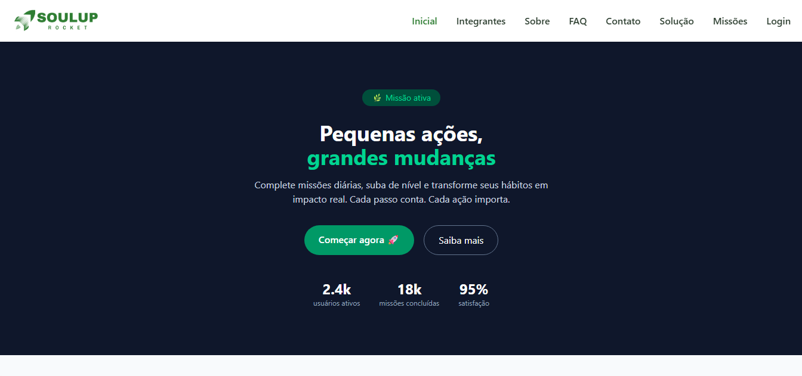
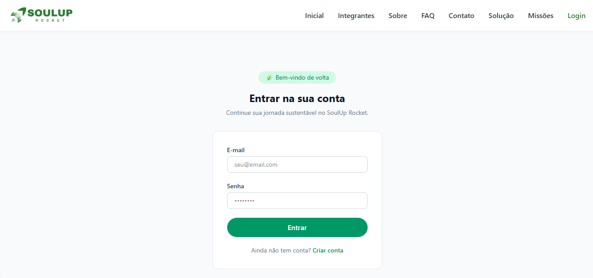
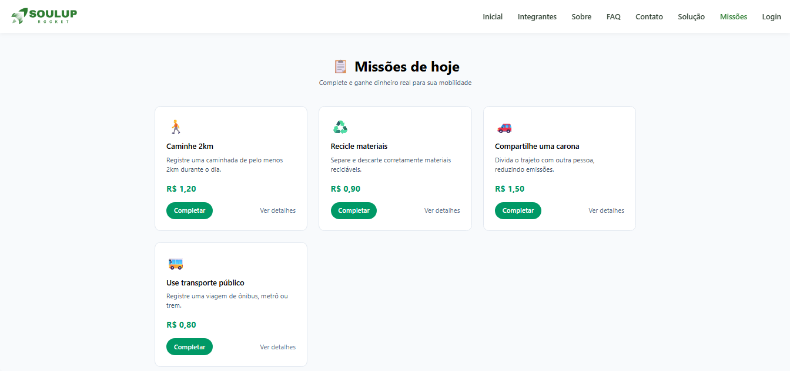

# 🚀 SoulUp Rocket

Plataforma que transforma ações sustentáveis do dia a dia em créditos reais para transporte público, unindo mobilidade urbana e sustentabilidade em uma única experiência gamificada.

> Desenvolvido pela equipe **Rocket** para o Challenge FIAP 2026 — 1º ano, Análise e Desenvolvimento de Sistemas, em parceria com a SoulUp.

---

## 📌 Sobre o projeto

Muitas pessoas deixam de utilizar o transporte público por causa do custo diário das passagens, enquanto ações sustentáveis do cotidiano não recebem incentivo suficiente para gerar impacto real. O **SoulUp Rocket** resolve os dois problemas ao mesmo tempo: os usuários completam missões diárias sustentáveis (como caminhar, reciclar ou compartilhar caronas), acumulam **EcoCoins** e trocam esse saldo por créditos reais de transporte público.

---

## 🛠️ Tecnologias utilizadas

<p>
  
  
  
  
  
  
  
  
</p>

---

## 📁 Estrutura de pastas

```
soul-up-rocket/
├── public/
├── src/
│   ├── assets/
│   │   └── imgs/
│   ├── components/
│   │   ├── Cabecalho/
│   │   ├── Menu/
│   │   └── Rodape/
│   ├── data/
│   │   └── missoes.ts
│   ├── pages/
│   │   ├── Home/
│   │   ├── Integrantes/
│   │   ├── Sobre/
│   │   ├── Faq/
│   │   ├── Contato/
│   │   ├── Solucao/
│   │   ├── Missoes/
│   │   ├── MissaoDetalhe/
│   │   ├── Login/
│   │   └── Cadastro/
│   ├── routes/
│   │   ├── AppRoutes.tsx
│   ├── App.tsx
│   └── main.tsx
├── index.html
├── package.json
├── tailwind.config.js
├── tsconfig.json
└── vite.config.ts
```

---

## 👥 Autores e créditos

| Foto | Nome | RM | Turma | Links |
|---|---|---|---|---|
|  | Sabrina Fraga Lima | 572548 | 1TDSPJ | [GitHub](https://github.com/sabrinafraga) · [LinkedIn](https://www.linkedin.com/in/sabrina-fraga-562777403/) |
|  | Tailyni Victoria Renovato Satirio | 570517 | 1TDSPJ | [GitHub](https://github.com/TailyniDev) · [LinkedIn](https://www.linkedin.com/in/tailynisatiriodev/) |
|  | Gabriel Tadeu | 571074 | 1TDSPJ | [GitHub](https://github.com/Tadeul) · [LinkedIn](https://www.linkedin.com/in/gabriel-tadeu-telles-brando-330216337/) |

---

## 🖼️ Imagens e ícones do projeto

>
> 
> 
> 

---

## ▶️ Como usar

### Rodando localmente

```bash
# clone o repositório
git clone https://github.com/TailyniDev/SOUL-UP---Challenger.git

# entre na pasta do projeto
cd soul-up-rocket

# instale as dependências
npm install

# rode o projeto
npm run dev
```

O projeto ficará disponível em `http://localhost:5173` (porta padrão do Vite).

### Links importantes

- 🔗 **Repositório GitHub:** https://github.com/TailyniDev/SOUL-UP---Challenger
- 🌐 **Deploy (Vercel):** _em breve_
- 🎥 **Vídeo de apresentação (YouTube):** https://youtu.be/uJxVWLbzB_8

---

## 📬 Contato

- 📧 challenge@soulup.com
- 🤝 Parceria SoulUp + FIAP · Challenge 2º Semestre 2026

---

© 2026 SoulUp Rocket — Equipe Rocket